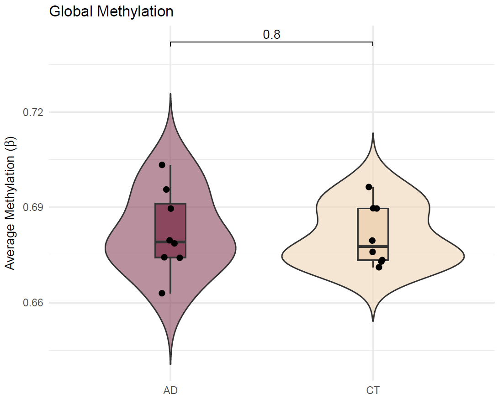
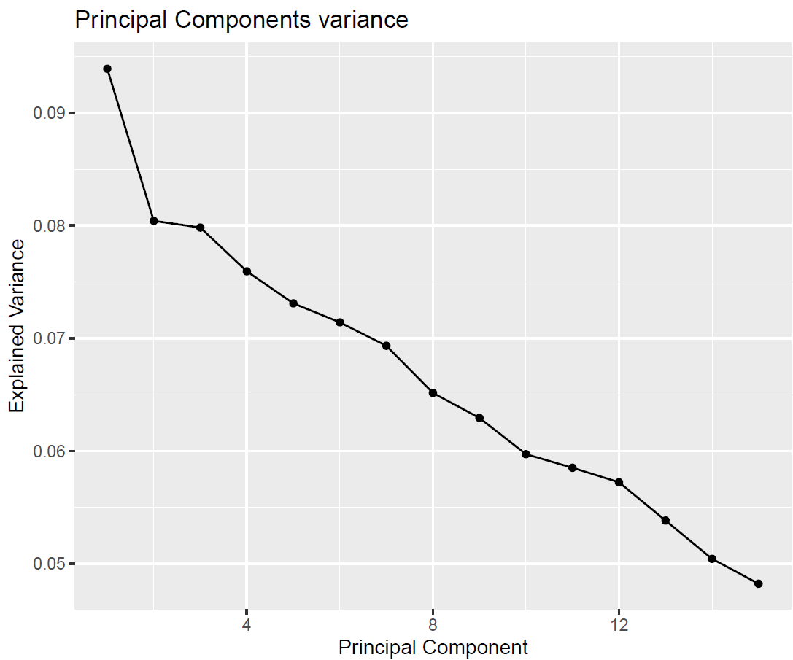
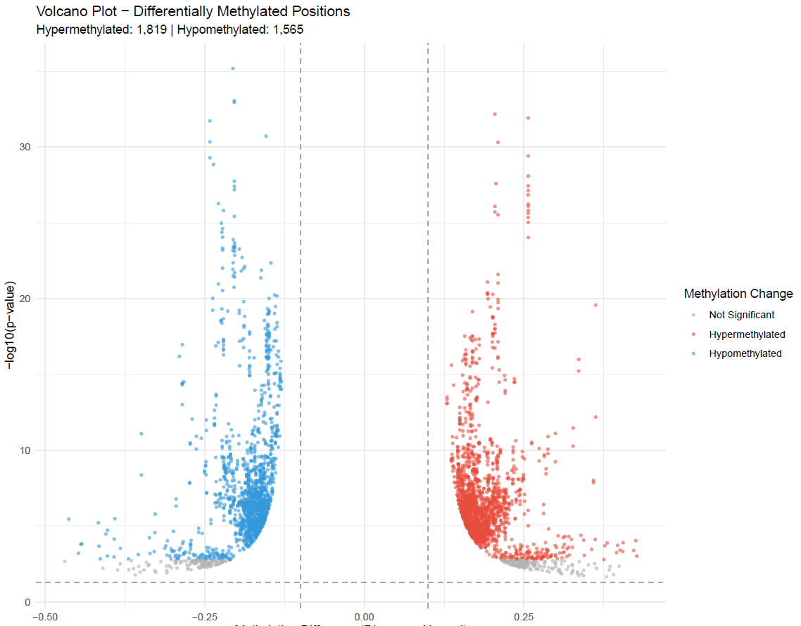
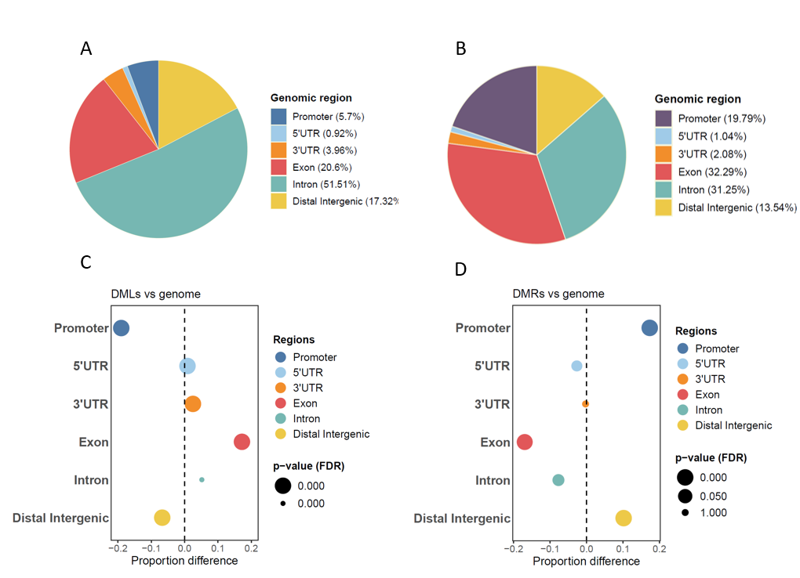
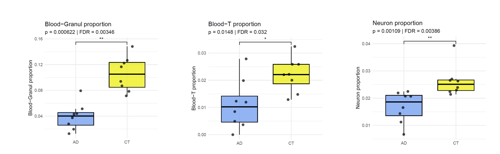

# Differential Methylation Analysis (DMLs and DMRs) in EM-Seq AD vs Control

This section details the bioinformatics pipeline for identifying and analyzing Differentially Methylated Loci (DMLs) and Regions (DMRs) using Enzymatic Methyl-Seq (EM-seq) data. The analysis was performed as part of my Master's Thesis in Bioinformatics and includes two primary comparisons:

1. **AD vs. Control samples** – To identify methylation signatures associated with AD pathogenesis.

The pipeline encompasses read methylation calling, quality control and statistical testing for DMLs/DMRs, followed by functional enrichment analysis of significant hits.

## Directory Structure
```
DMA/
├── Results/ # Final output files (tables, plots, reports)
├── Scripts/ # Analysis scripts (R/Rmd)

```
##  Analysis Pipeline Overview

The DMA workflow consists of three main phases:

1. **Preprocessing & Quality Control**
2. **Differential Methylation Calling**
3. **Functional Enrichment Analysis**

### 1. Preprocessing & Quality Control

Key steps performed in [`DSS_Analysis.R`](Script/DSS_analysis.R):

- **SNP filtering**: Removed CpGs overlapping with common SNPs (MAF ≥ 10%) (dowload: https://genome.ucsc.edu/cgi-bin/hgTrackUi?db=hg38&g=snp151Common) 
- **Coverage filtering**: Kept CpGs with ≥10x coverage in ≥4 samples per group (applied separately for AD vs. Control).
- **Quality Control**:
  - Global methylation distributions (by condition).
  
 |

 - PCA of methylation profiles.
   
|

### 2. Differential Methylation Analysis
Performed using the **DSS** package with consistent parameters for both comparisons:

```r
dmr_params = list(
  delta = 0.1,          # Minimum methylation difference
  p.threshold = 1e-5,   # Significance threshold
  minlen = 50,          # Minimum DMR length (bp)
  minCG = 3,            # Minimum CpGs per DMR
  dis.merge = 100,      # Max distance to merge nearby DMRs
  pct.sig = 0.5         # Minimum proportion of significant CpGs in DMR
)
```
**Key Results:**
1. AD vs. Control:
    The 3384 significant DML from the 1299319 CpGs tested

    The 96 significant DMRs with genomic annotations.

|  
Volcano plots for AD vs. Control comparisons (FDR < 0.05, |Δβ| > 0.10).

### 3. Genomic distribution , CpG context and enrichment.

|
A) Genomic distribution of DMLs B) Genomic distribution DMRs C) Enrichment of DMLs D) Enrichment of DMRs

### 4. Functional Enrichment Analysis
Performed in [methylation_enrichment_analysis.Rmd](Script/Functional_Enrichment.R)

- Gene Ontology (BP, CC, MF).
- KEGG Pathway analysis.


 
Top enriched pathways for AD-associated DMLs 

### 5. Deconvolution

|

## 🔧 Software Stack

**Primary Packages:**
- DSS (v2.42.0) - Differential methylation analysis
- bsseq (v1.36.0) - Bisulfite sequencing data handling
- ChiPsekeer (1.46.1 ) - Genomic annotation
- rGREAT (v2.12.2) ) - Functional enrichment
- UXM (v0.1.0) -Deconvolution
- 
**Visualization:**
- ggplot2 (v3.4.0)

## 📝 Interpretation Notes
1. DML/DMR Thresholds: Used conservative cutoffs (Δβ ≥ 0.1, FDR < 0.05)

3. Gene Annotation: Combined gene-based and CpG island annotations

4. Biological Relevance: Focused enrichment on neuronal pathways and AD-associated terms

For detailed methodology, see the individual script headers and thesis documentation.
